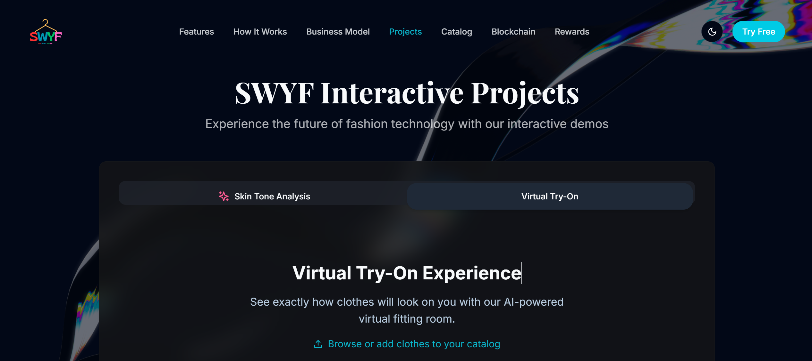
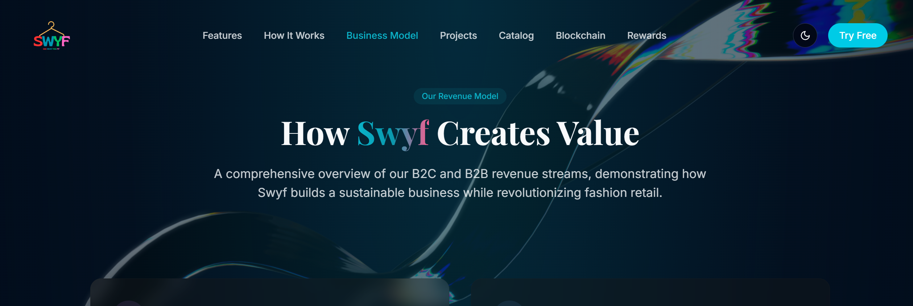

# SWYF - See What You Fit

<p align="center">
  
</p>

> **Project Status: Early Development (Started: April 4, 2025)**
>
> This project is currently in its initial development phase. Core features are functional but may contain bugs. Please report any issues through our issue tracker.

SWYF is an innovative AI-powered virtual try-on platform that revolutionizes online fashion shopping, allowing users to visualize how clothes will look on them before making a purchase.

## 📋 Table of Contents

- [Features](#features)
- [Project Structure](#project-structure)
- [Screenshots](#screenshots)
- [Technologies Used](#technologies-used)
- [Installation](#installation)
- [Usage](#usage)
- [Rewards System](#rewards-system)
- [Development Log](#development-log)
- [Current Status](#current-status)
- [Acknowledgements](#acknowledgements)
- [License](#license)

## ✨ Features

- 👔 **Virtual Try-On**: Try clothing items virtually in real-time using AI technology
- 🎨 **Skin Tone Analysis**: Get personalized color recommendations based on your skin tone
- 🏆 **Rewards Program**: Earn points for interactions with the platform
- 💳 **Buy Now Pay Later**: Flexible payment options
- 📱 **Responsive Design**: Works seamlessly on desktop and mobile devices
- 🌙 **Dark Mode Support**: Enhanced viewing experience with full dark mode support
- 🔄 **Interactive 3D Background**: Engaging user experience with interactive Spline 3D elements
- 📦 **Product Catalog**: Browse and manage clothing items for virtual try-on
- 🤝 **Partner Integration**: Opportunity for retailers to integrate with our platform

## 🏗️ Project Structure

```
swyf/
├── frontend/                    # React frontend application
│   ├── src/                     # Source code
│   │   ├── components/          # Reusable components
│   │   ├── pages/               # Page components
│   │   ├── contexts/            # React contexts (Theme, etc.)
│   │   ├── hooks/               # Custom React hooks
│   │   ├── lib/                 # Utility functions
│   │   ├── App.tsx              # Main application component
│   │   └── ...                  # Other React files
│   ├── public/                  # Public assets
│   ├── package.json             # Node.js dependencies
│   └── ...                      # Configuration files
│
├── services/                    # Backend services
│   ├── virtual-tryon/           # Virtual try-on service
│   │   ├── app/                 # Flask application modules
│   │   ├── static/              # Static assets
│   │   │   ├── assets/          # Image assets
│   │   │   └── react-app/       # Built React app
│   │   ├── templates/           # HTML templates
│   │   └── flasktry.py          # Main Flask application
│   │
│   └── skin-tone/               # Skin tone analysis service
│       ├── src/                 # Source code
│       ├── tests/               # Unit tests
│       └── docs/                # Documentation
│
├── assets/                      # Shared assets
│   ├── landingpage.jpg          # Landing page preview
│   └── ...                      # Other image assets
│
├── docs/                        # Project documentation
│   └── ...                      # Documentation files
│
└── README.md                    # Project documentation
```

## 📸 Screenshots of site

> **Note:** These are early prototype screenshots. The UI is evolving daily as we develop the platform.

### Landing Page

*Our modern, engaging landing page showcasing SWYF's key features*

### Projects

*AI-driven skin tone detection with virtual try-on for customized outfit suggestions*

### Rewards System

*Track your rewards journey and earn points for platform interactions*

### Business Model

*Augmented Reality try-on platform for mobile devices, offering B2C personalization and B2B integration for brands and retailers*

## 🛠️ Technologies Used

### Frontend
- React.js with TypeScript
- Tailwind CSS for styling
- React Router for navigation
- Shadcn/ui for UI components
- Lucide React for icons
- TanStack Query for data fetching
- Spline for 3D interactive backgrounds
- Context API for state management

### Backend
- Flask (Python)
- OpenCV for image processing
- TensorFlow/PyTorch for AI models
- RESTful API design

## 🚀 Installation

> **Note:** Installation steps are evolving as the project develops. Check back for updates.

### Prerequisites
- Node.js (v16+)
- Python (v3.8+)
- pip
- Git

### Setup

1. Clone the repository:
```bash
git clone https://github.com/Vatsal212005/SWYF-Virtual-TryOn.git
cd swyf
```

2. Set up the virtual try-on service:
```bash
cd services/virtual-tryon
pip install -r requirements.txt
```

3. Set up the skin tone analysis service:
```bash
cd ../skin-tone
pip install -r requirements.txt
```

4. Set up the frontend:
```bash
cd ../../frontend
npm install
```

5. Build the frontend:
```bash
npm run build
```

6. Copy the built files to the Flask static directory:
```bash
cp -r dist/* ../services/virtual-tryon/static/react-app/
```

## 💻 Usage

1. Start the virtual try-on service:
```bash
cd services/virtual-tryon
python flasktry.py
```

2. For development of the frontend:
```bash
cd frontend
npm run dev
```

3. Access the application:
   - Main application: `http://localhost:5000`
   - Development server: `http://localhost:3000`

## 🏆 Rewards System

Our rewards program offers:

- **Loyalty Points**: Earn points for every interaction with the platform
- **Progress Tracking**: Track your rewards journey
- **Exclusive Benefits**: Unlock discounts, early access, and special features
- **Multi-level Rewards**: Progress through different levels to earn more benefits

## 📞 Contact Information

- **Headquarters**: Sector 61, Noida, Uttar Pradesh, India
- **Phone**: +91 8588077790
- **Email**: swyam7@gmail.com
- **Business Hours**: Monday - Friday: 9am - 6pm IST

## 📄 License

SWYF is proprietary software. All rights reserved.

© 2025 SWYF - See What You Fit 
